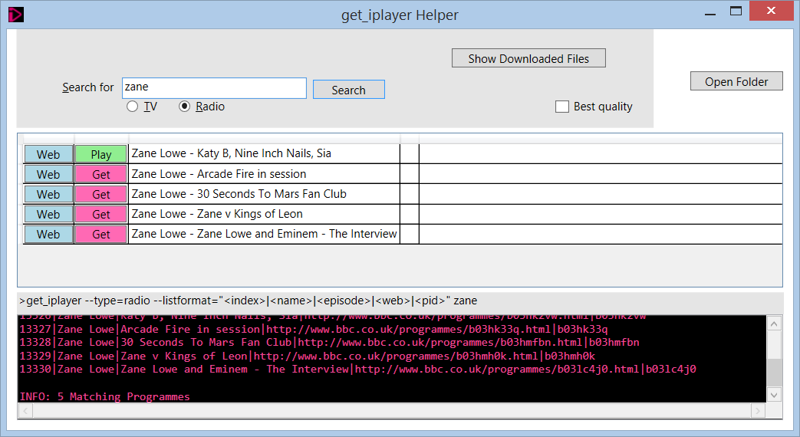

get_iplayer-Helper
==================

Basic Windows user interface for the get-iplayer command-line utility.
<<<<<<< HEAD

01/11/2014: Looks like this won't work anymore

http://www.bbc.co.uk/blogs/internet/posts/Introducing-Platform-API?postId=120679555

http://www.reddit.com/r/BritishTV/comments/2kwh6p/bbc_removes_programme_feeds_a_blow_to_get_iplayer/

=======

>>>>>>> parent of 1868756... Update README.md
